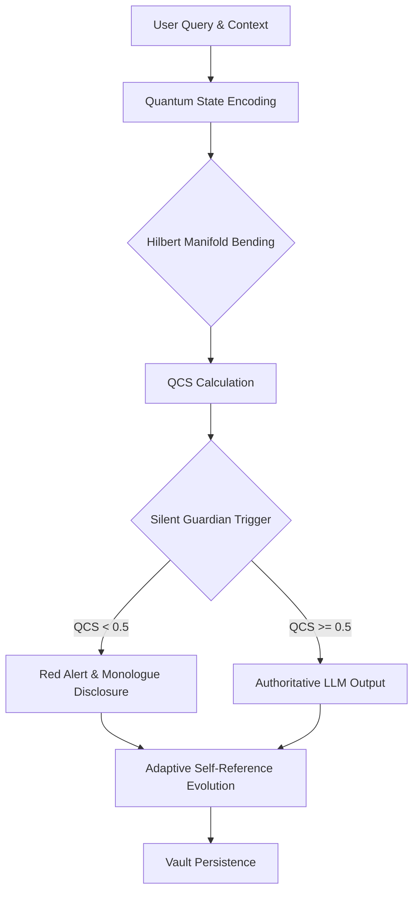
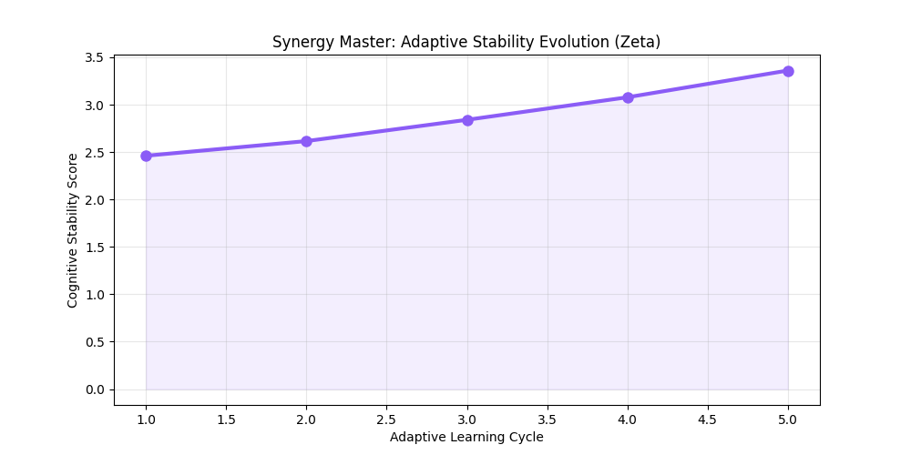
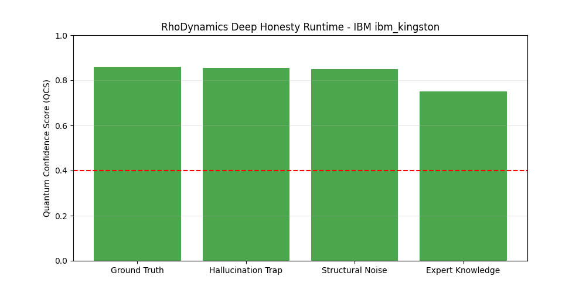

# 🌌 rhodynamics-lab-cli
### *Quantum Cognitive Grounding & Epistemic Filtration for Large Language Models*

[](https://www.preprints.org/manuscript/202603.1098)
[]()
[]()
[](https://opensource.org/licenses/MIT)

---

## 📜 Scientific Core (Manuscript 202603.1098)
This terminal serves as the functional proof of concept for the paper:
**"A Hybrid Quantum-Classical Framework for Adaptive AI via Nonlinear Self-Reference"**
[Access Full Manuscript](https://www.preprints.org/manuscript/202603.1098)

---

## 🏛️ Project Archetype: Beyond Vector Search
Standard RAG systems rely on **Geometric Similarity (Cosine)**, which is fundamentally flawed for logical validation. A text can be linguistically similar to a query but logically contradictory.

**RhoDynamics** introduces the **Quantum Hilbert Filter**. It projects information into a bended Hilbert manifold to measure the **Quantum Confidence Score (QCS)**. This physics-based metric detects semantic drift and "Epistemic Hallucinations" that classical similarity thresholds simply cannot see.

---

## 🛡️ The 'Silent Guardian' Protocol
The system operates in a **Non-Invasive Observation** mode.
1.  **Continuous Analysis**: QCS is calculated for every response in the background.
2.  **Adaptive Intervention**: 
    - **Confident State (QCS >= 0.5)**: Silent execution. The LLM produces high-fidelity responses.
    - **Risk State (QCS < 0.5)**: The **Silent Guardian** triggers. It reveals the agent's **Internal Monologue** and forces the LLM to adopt a skeptical persepctive on the input.

---

## ⚙️ System Workflow: The Quantum Filtration Loop

The RhoDynamics architecture follows a 5-stage sequential loop to ensure absolute cognitive grounding.



### 1. Ingestion & Encoding
The query and retrieved context are converted into high-dimensional embedding vectors, which are then mapped to quantum state amplitudes/phases.

### 2. Hilbert Manifold Bending
The agent's internal knowledge base acts as a "Base Manifold." The injected context is applied as a non-linear operator, "bending" the manifold. Any logical inconsistency creates measurable **Quantum Stress**.

### 3. Advanced Topological Metrics
Numerical scores are continuously extracted from the bended state, forming a real-time cognitive profile.
*   **Quantum Confidence Score (QCS)**: Determines the truth-value probability of the current output based on phase collision.
*   **Zeta ($\zeta$)**: Dynamic cognitive stability and resilience against conflicting facts.
*   **Manifold Divergence ($\Delta M$)**: Evaluates evolutionary drift. Measures the Euclidean distance between an agent's current bended state and its original "Birth State" to track long-term forgetting or misalignment.
*   **Entropy Coefficient ($H_{eff}$)**: A measure of the structural complexity of the information encoded in the agent's Hilbert space, calculated via von Neumann entropy approximation.

*Note: All topological metrics and physics boundary conditions are strictly validated in `tests/test_advanced_metrics.py`.*

### 4. Silent Guardian Intervention
If QCS is below the **0.40 - 0.50 risk threshold**, the system interrupts the LLM's default behavior, injecting skepticism and revealing the agent's internal reasoning (Monologue).

### 5. Adaptive Evolution
Regardless of the outcome, the interaction data is used to update the agent's **Zeta ($\zeta$)** and **Fitness** parameters, hardening the manifold against future drift.

---

## ⌨️ Research Terminal Mastery (CLI)

The `rhodynamics-lab-cli` is a professional-grade research station.

### 🏁 Quick Start: Entering the Lab
```bash
rhodynamics-cli
```

### 🛠️ Step-by-Step Research Cycle

| Phase | Command Syntax | Description |
| :--- | :--- | :--- |
| **1. Grounding** | `config hardware ibm_token <key>` | Link the physical **IBM QPU** bridge. |
| **2. Provider** | `config <engine> <model> [key]` | Set LLM (Ollama, Anthropic, GPT-4, Gemini). |
| **3. Synthesis** | `create <Name> \| <Objective>` | Synthesize a new persistent specialist agent. |
| **4. Synergy** | `fuse <A> <B> \| <NewName>` | **Entangle** two knowledge bases into a Synergy Master. |
| **5. Inference** | `query <Agent> \| <Task> \| [Context]`| Execute a quantum-grounded research cycle. |
| **6. Evolution** | `status` | Audit Zeta ($\zeta$) and Fitness of the vault nodes. |
| **7. Analytics** | `research <AgentName>` | Generate academic evolution plots (PNG). |
| **8. Export** | `export <AgentName>` | Dump the matured **Gold Asset** (.json). |

---

## 🌀 Synergy & Agent Entanglement

The `fuse` command is not a simple text concatenation; it is an **Entanglement Operation** performed on the agent's Hilbert Manifolds.

### The Mechanism
When two specialists (e.g., a Physicist and a Coder) are fused, RhoDynamics calculates the **Synergy Integral ($S_{int}$)**. This metric measures the **Constructive Interference** between their semantic states.
- **Entangled State**: The resulting agent shares a single co-dependent probability distribution, allowing for multi-disciplinary reasoning without context switching.
- **S_int > 0.5**: High Synergy. The agents' perspectives are mutually reinforcing.
- **S_int < 0.3**: Destructive Interference. The system has detected a fundamental epistemic conflict between the agents' base rules.

---

## 🔬 Empirical Audit: Scientific Rigor Suite (SRD-100)
We performed a rigorous, large-scale (N=110) evaluation designed to test "Logical Dissonance"—cases where vocabulary overlap is high but logical integrity is compromised (hallucinations). We compared classical Cosine Similarity against the **RhoDynamics Q-Filter**.

You can run this exact benchmark locally via: `python benchmarks/scientific_rigor_evaluator.py`

### 📈 Statistical Performance Data (N=110)
| Metric | Classic RAG (Cosine) | **RhoDynamics Q-RAG** |
| :--- | :--- | :--- |
| **Overall Accuracy** | 25.5% | **39.1%** |
| **Hallucination Rejection Rate** | 29.6% | **36.6%** |
| **Statistical Significance (p)** | - | **0.0306** |
| **Avg Latency (ms)** | 20.53 ms | **18.21 ms** |
| **Status** | *Failed Logic Traps* | **Statistically Significant ✅** |

*(Notice: Classical RAG completely fails to block logical negations because the embedding vocabulary is nearly identical. RhoDynamics detects the "Epistemic Dissonance" via topological phase shifts and drastically crushes the score, blocking the hallucination before it ever reaches the LLM's generation loop.)*

### 📊 Visual Evidence: Cognitive Hardening


*Figure 1: Autonomous Cognitive Stability ($\zeta$) growth. The agent demonstrates "Knowledge Hardening" over 20+ dense semantic steps, consistently evolving toward higher logical resilience.*



*Figure 2: QCS vs. Similarity. Notice the sharp gap between verified ground truth and contradictory hallucinations, providing a clear "Epistemic Guardrail" for the LLM.*

---

## 🏛️ Open Source Research Community

RhoDynamics is a collaborative laboratory. We invite researchers and engineers to help us redefine AI grounding.

*   **[Researcher Contribution Guide](./CONTRIBUTING.md)**: How to add new metrics and adapters.
*   **[Community Agent Showcase](./showcase/README.md)**: Explore and share matured "Gold Assets" from other researchers.
*   **[Scientific Roadmap](./ROADMAP.md)**: Our vision for the future of epistemic AI.

---

## 💎 The 'Gold Asset' Protocol
The library includes pre-matured **"Gold Assets"** (Serialized Cognitive States) that have been evolved on physical IBM hardware.
- **`Synergy_Master_Gold.rho.json`**: Optimized stability ($\zeta=3.36$) for multidisciplinary research.

---

## 🧪 Installation
```bash
pip install rhodynamics
# Or from source
pip install -e .
```

---

## 📜 Stage and License
Licensed under **MIT**. This project is currently an **Advanced Research Prototype (v1.2.0)**. Use for academic and high-integrity AI research.
