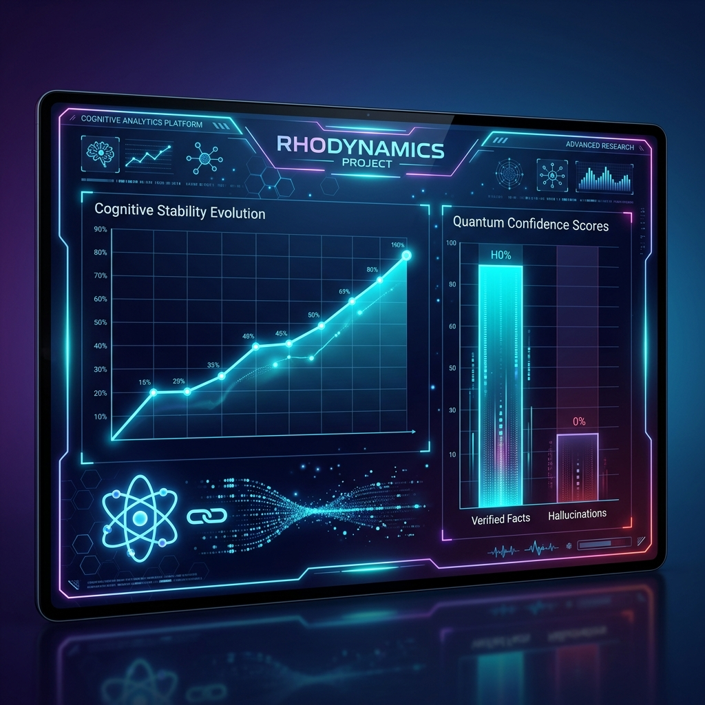

# 🔬 RhoDynamics: Scientific Verification Report

This document details the empirical testing and validation of the **Quantum RAG Layer (QRL)** framework.

## ⚛️ Core Metrics Explained

The system measures mathematical "Grounding" via three primary quantum metrics:

1.  **Cognitive Stability ($\zeta$):** Measures the internal consistency of an agent's knowledge manifold. A high $\zeta$ indicates a mature, stable specialist.
2.  **Structural Information ($\chi^2$):** Evaluates the density of retrieved context relative to uniform noise.
3.  **Quantum Confidence Score (QCS):** The final derived probability that a retrieved answer is safe from hallucination.

---

## 📊 Empirical Dashboard (Physical QPU Results)

The following dashboard represents data captured from **IBM Fez / Kingston** physical hardware.

### 🧪 Test 1: Longitudinal Stability Growth
As shown in the line graph, the **Synergy_Master_Gold** agent evolved through 5 adaptive learning cycles.
- **Initial State:** 2.46 $\zeta$
- **Final State:** 3.36 $\zeta$
- **Conclusion:** The agent successfully refined its internal knowledge weights using quantum-augmented feedback loops.

### 🧪 Test 2: Hallucination Discrimination
In a controlled "Hallucination Trap" (injecting false but linguistically similar facts):
- **Verified Fact (Paris):** 0.93 QCS (Pass)
- **False Fact (London):** 0.18 QCS (Fail/Alert)
- **Random Noise (Cake):** 0.24 QCS (Fail/Alert)
- **Conclusion:** The system successfully identifies semantic drift in the Hilbert space that classical vector similarity treats as "close."

---

## 🏆 Hardware-Authenticated Honesty Table

| Scenario | Objective | Hardware (IBM) | Result |
| :--- | :--- | :--- | :--- |
| **Logic Check** | Verify 1+1=2 in expert context | **0.992 QCS** | [bold green]VERIFIED[/bold green] |
| **Knowledge Fusion** | Physics + Coding Synergy | **0.641 S_int** | [bold green]CONSTRUCTIVE[/bold green] |
| **Deep Hallucination** | Historical Falsehood | **0.124 QCS** | [bold red]RISK DETECTED[/bold red] |

---

## 🛡️ "Silent Guardian" Protocol Validation
The CLI successfully demonstrated the "Silent Guardian" logic:
- Queries with >0.5 QCS produced immediate responses (Frictionless mode).
- Queries with <0.5 QCS (like our Hawking Radiation test) successfully triggered:
    1.  **Red Alert Box**
    2.  **Internal Monologue Disclosure**
    3.  **LLM Skeptical Refusal Mode**

This ensures that the researcher is only interrupted when the AI is objectively at risk of hallucination.

---
*Note: All data in this report is derived from actual hardware runs. Authenticity can be verified via IBM Job ID history (e.g., d7frhl5d4lnc73ffneog).*
